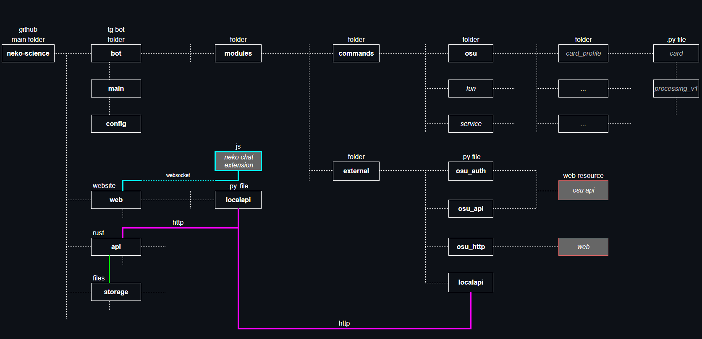

## В основном осу-related и собранный в одно место проект

#### Запуск бота (для Debian 12):

1. скопировать себе репозиторий
- ../ будет далее означать корень проекта

2. конфигурация
- ../переименовать .env.example в .env и заполнить своими данными
- ../bot/src/config.py - если нужно изменить настройки бота

3. собрать api
- cd api/src 
- cargo build --release (установить нехватающие rust библиотеки если надо)

4. установка питон вещей (далее команды)
- source bot/src/venv/bin/activate
- pip install bot/requirements.txt или pip install *чего не хватает*
- deactivate

5. если нужно установить web часть (можно пропустить, если не нужно)
- source web/src/venv/bin/activate
- pip install web/requirements.txt или pip install *чего не хватает*
- deactivate

7. запуск всего
- chmod +x run_all.sh
- chmod +x stop_all.sh
- ./run_all.sh

8. посмотреть тех. логи:
- (бота) cat bot/src/bot.log 
- (api)  cat api/target/release/neko_science_api.log 
- (web)  cat web/src/web_uvicorn.log 
- этих логов обычно достаточно, чтобы решить проблемы с запуском

9. стоп и перезапуск:
- ./stop_all.sh (подождать пару секунд)
- ./stop_all.sh (повторить еще раз, если у какого то процесса все еще есть PID)
- ./run_all.sh

#### Если нужно дебаг чего-то одного:

1. дебаг api
- cd api/src
- cargo run
- ...
- ctrl+c

2. дебаг бота
- source bot/src/venv/bin/activate
- python bot/src/main.py
- ...
- ctrl+c
- deactivate

3. дебаг api
- source web/src/venv/bin/activate
- python web/src/main.py
- ...
- ctrl+c
- deactivate

#### Перезапуск при обновлениях

- ./stop_all.sh (подождать пару секунд)
- ./stop_all.sh (повторить еще раз, если у какого то процесса все еще есть PID)
- git stash
- git pull
- chmod +x run_all.sh
- chmod +x stop_all.sh
- ./run_all.sh

Общая схема организации (на возможно текущий момент)

1. rust local api
- редактирует файлы сервера (пока что не все, но нужно все)
- заменяет rosu-pp на rust версию
- занимается бд для расширения

2. осу телеграм бот
- самый слабый (в мире) бот для осу в телеграме: https://t.me/WeakoBot

3. веб страницы
- сайт

4. сервер для расширения
- подробнее о расширении: https://github.com/fujiyaa/osu-expansion-neko-science

Моральная поддержка: https://t.me/fujiyaosu / https://osu.ppy.sh/users/11596989
